# Create your Compartment and Virtual Cloud Network  

## Introduction

Create a compartment and Virtual Cloud Network (VCN) to connect your Linux instance to the internet. You will configure all the components needed to create your virtual network.

_Estimated Time:_ 15 minutes

### Objectives

In this lab, you will be guided through the following tasks:

- Create Compartment
- Create Virtual Cloud Network
- Configure security list to allow MySQL incoming connections

### Prerequisites

- An Oracle Free Tier or Paid Cloud Account
- A web browser
- Login to OCI to land on OCI Dashboard

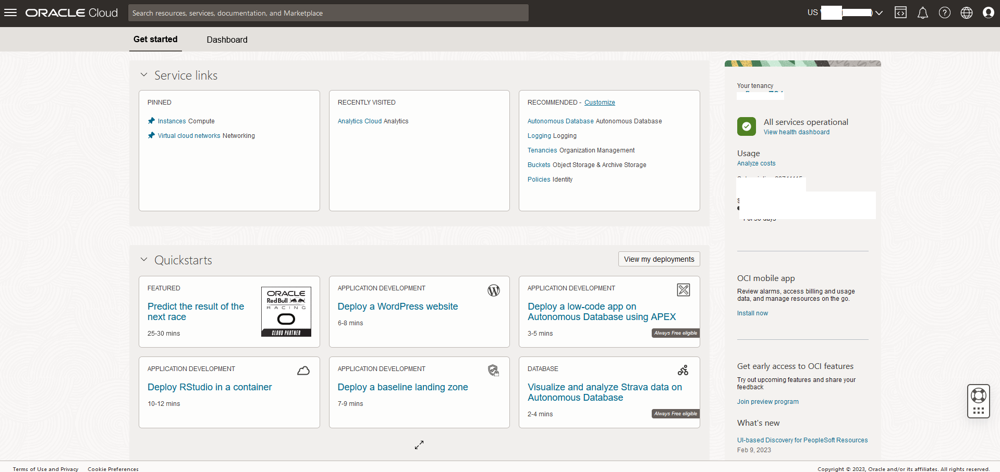

## Task 1: Create Compartment

1. Click the **Navigation Menu** in the upper left, navigate to **Identity & Security** and select **Compartments**.

2. On the Compartments page, click **Create Compartment**.

    **Note:** Two Compartments, _Oracle Account Name_ (root) and a compartment for PaaS, were automatically created by the Oracle Cloud.

3. In the Create Compartment dialog box, in the **NAME** field, enter **heatwave**, and then enter a Description enter **Comaprtment for MySQL HeatWave Database and components**, select the **Parent Compartment**, and click **Create Compartment**.

## Task 2: Create Virtual Cloud Network

1. Click Navigation Menu
    Select Networking
    Select Virtual Cloud Networks
    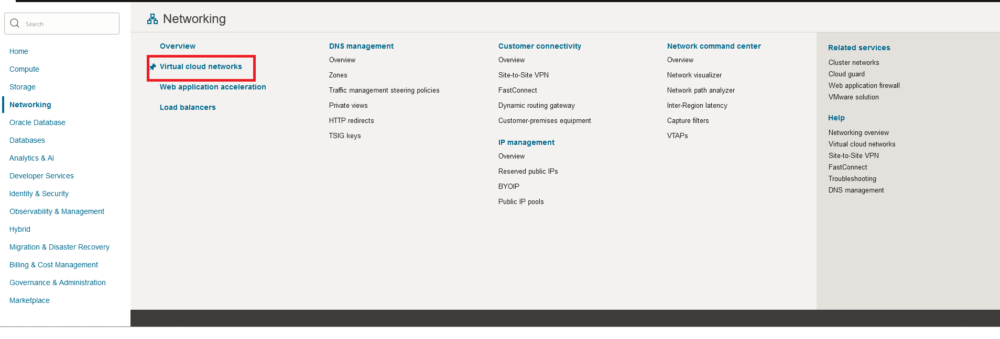

2. Click **Start VCN Wizard**
    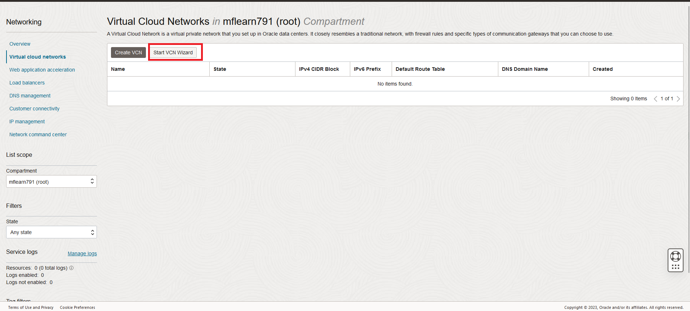

3. Select 'Create VCN with Internet Connectivity'

    Click 'Start VCN Wizard'
    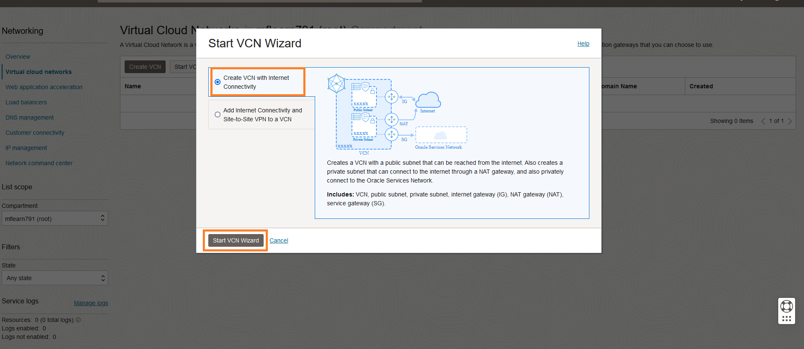

4. Create a VCN with Internet Connectivity

    On Basic Information, complete the following fields:

    VCN Name:

    ```bash
    <copy>heatwave-vcn</copy>
    ```

    Compartment: Select  **heatwave**

    Your screen should look similar to the following
        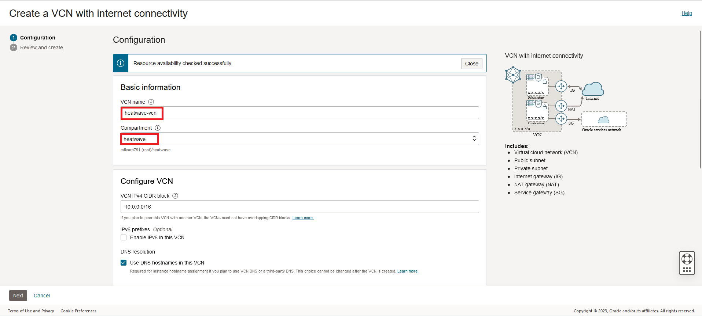

5. Click 'Next' at the bottom of the screen

6. Review Oracle Virtual Cloud Network (VCN), Subnets, and Gateways

    Click 'Create' to create the VCN

7. The Virtual Cloud Network creation is completing
    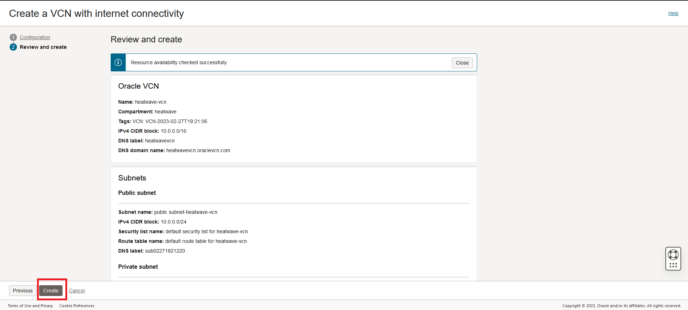

8. Click 'View VCN' to display the created VCN
    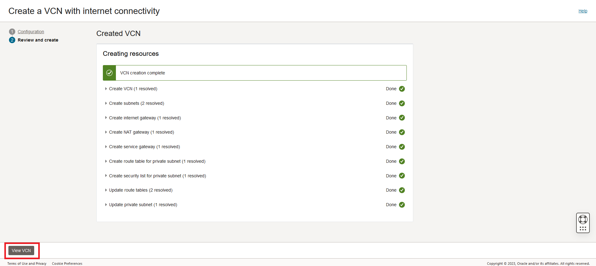

## Task 3: Configure security list to allow MySQL incoming connections

1. On MDS-VCN page under 'Subnets in (root) Compartment', click  '**Private Subnet-MDS-VCN**'
     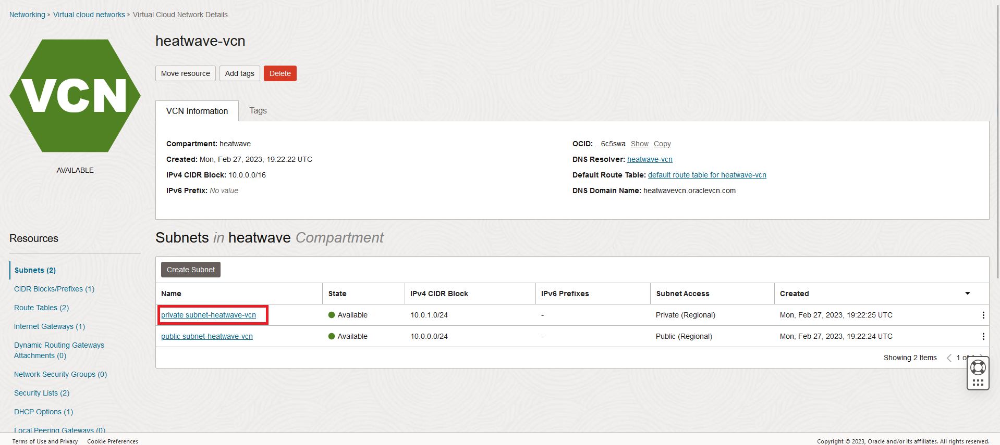

2. On Private Subnet-MDS-VCN page under 'Security Lists',  click  '**Security List for Private Subnet-MDS-VCN**'
    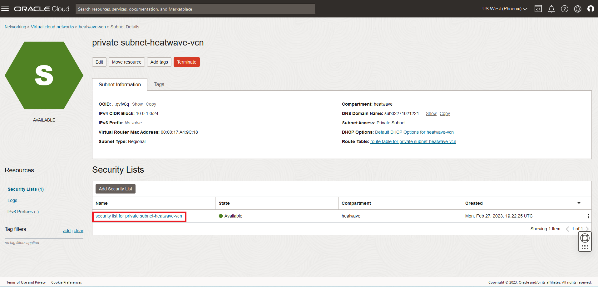

3. On Security List for Private Subnet-MDS-VCN page under 'Ingress Rules', click '**Add Ingress Rules**'
    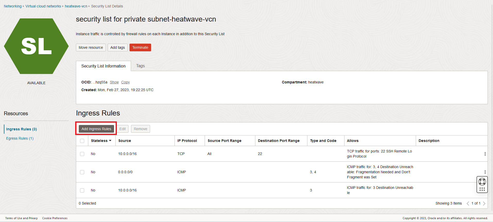

4. On Add Ingress Rules page under Ingress Rule 1

    Add an Ingress Rule with Source CIDR

        ```<copy>0.0.0.0/0</copy>```

    Destination Port Range 

        ```<copy>3306,33060</copy>```
    
    Description 

        ```<copy>MySQL Port Access</copy>```
        
    Click 'Add Ingress Rule'
        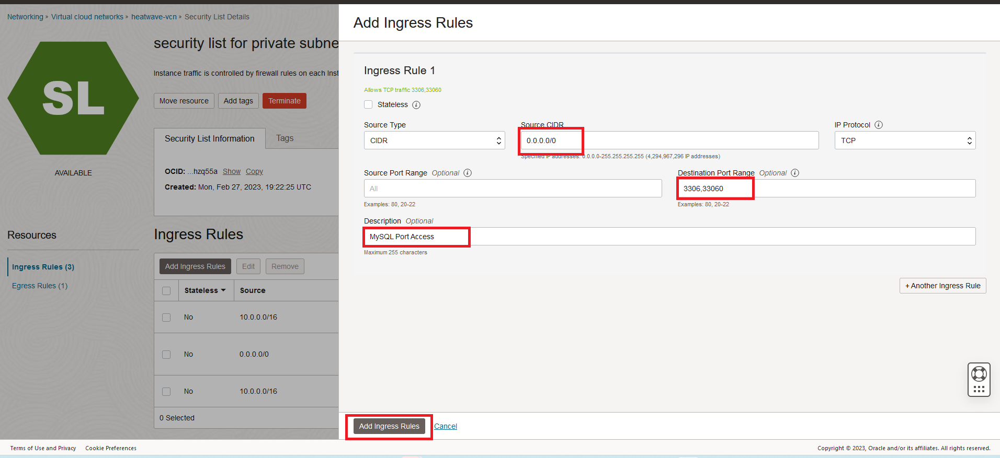

5. On Security List for Private Subnet-MDS-VCN page, the new Ingress Rules will be shown under the Ingress Rules List
    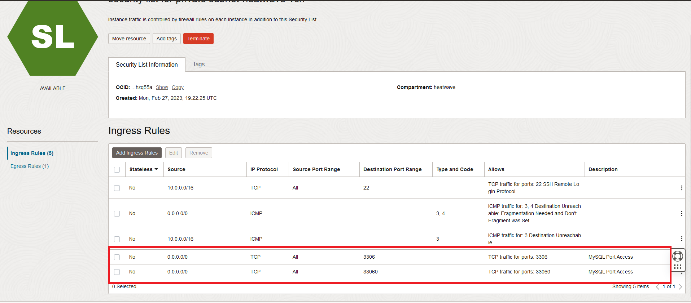

## Acknowledgements

- **Author** - Perside Foster, MySQL Solution Engineering
- **Contributors** - Salil Pradhan, Principal Product Manager, Nick Mader, MySQL Global Channel Enablement & Strategy Manager
- **Last Updated By/Date** - Perside Foster, MySQL Solution Engineering, March 2023
